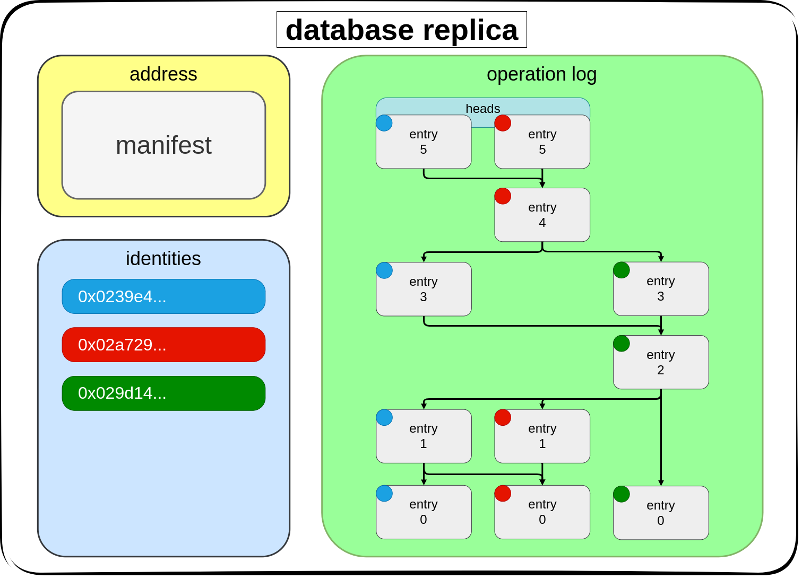
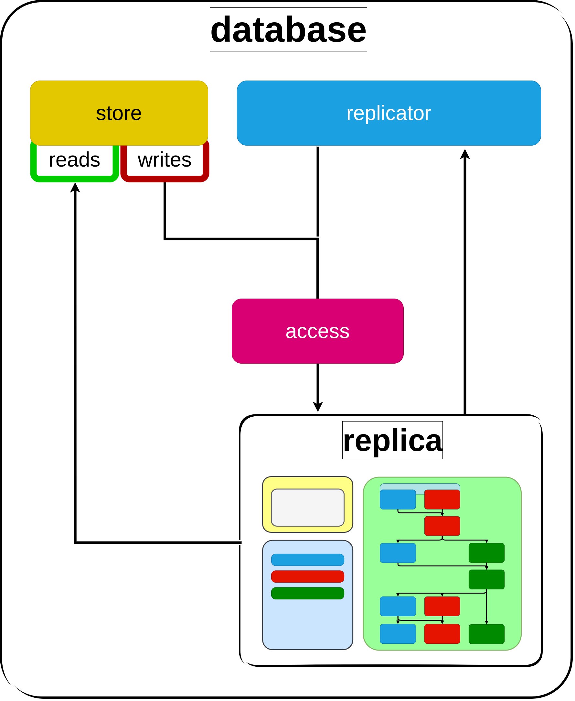

# 

# Protocol Overview

-----

# Table of Contents

- [Introduction](#introduction)
- [Replica](#replica)
- [Processes](#processes)
- [The CRDT](#the-crdt)
- [Fundamental Limits](#fundamental-limits)
- [Design in Use](#design-in-use)

## Introduction

The Opal protocol spec defines a way to create and participate in shared, mutable states with other peers using CRDTs.
Each peer maintains its own copy of the database called a replica.
Instead of reading from a remote database, the peer's local replica is used as the source of truth.

A participant can read and write to the database while offline.
Updates they make while disconnected from peers can be communicated and merged later in a conflict-free way.
Peers with the same set of updates will have the same database state.

## Replica

The replica is the main part of the database.
There are three data formats that make up the database replica: the manifest, entry, and identity.

The [manifest](./manifest) is a setup document.
It contains rules and configuration needed to run the database.
Nodes that setup their database with the manifest configuration will satisfy strong eventual consistency;
no additional agreement or coordination is required.
The hash of the manifest is used to identify the database.

The [entry](./entry) is the CRDT part of the database.
Each entry is a DAG node with causal links to previous entries.
They make up the immutable log of updates to the database store.

The [identity](./identity) contains a public key.
Each entry has an identity associated with it for verification of the entry signature and access control.

A database replica is made up of a manifest with entry and identity sets.

## Processes

The replica is processed by a few different components: 

 - [store](./store): interface to read and write to the database.

 - [access](./access): access control/write protection to the database.

 - [replicator](./replicator): syncs replica with peers.

## The CRDT

[Merkle-CRDTs](https://research.protocol.ai/publications/merkle-crdts-merkle-dags-meet-crdts/) are a combination of [Merkle-DAGs](https://docs.ipfs.tech/concepts/merkle-dag/) and CRDTs.
The CRDT is stored inside of a Merkle-DAG which provides deduplication/hash linking.

Unique properties of Merkle-CRDTs:
- immune to sybil attacks
- immune to clock poisoning attacks
- byzantine eventual consistency
- replication logic can be separated from the underlying network
- convenient data layer for storage and replication

## Fundamental Limits

Do not try to build a cryptocurrency with Opal (unless you really, really want to).
There are some things you cannot do with Opal and similar peer-to-peer databases.
These limits are very well explained in [Byzantine Eventual Consistency and the Fundamental Limits of Peer-to-Peer Databases](https://martin.kleppmann.com/2021/10/07/consensusdays.html).
With Opal we allow concurrent and async updates to occur and be merged.
This is a great property to have in some applications, but for others with invariants like *no negative numbers* this isn't doable.

## Design in Use

Designing applications with Opal can feel very different.
Understanding it's differences and a few tricks will result in a better design.
One of the biggest differences is that there is no idea of a global and consistent state in Opal, peers replicas are allowed to diverge and converge over and over.
Something else developers may find very different is that the database is local and can be read quickly and without network interruption.

It's best to [partition](https://en.wikipedia.org/wiki/Partition_(database)) databases (per user or even further) instead of having one for everything.
A database where some or all writers will never build upon others updates should be partitioned.

The more databases that can exist in your application bring a problem. How are they found?
The address of the database could be hardcoded, but in a lot of situations there are too many.
A database could be used to track the other database addresses, but in some situations that's not the best option.
A third option is for your application to know the scheme in which the manifests are created.

If you are able to determine the manifest data from knowing things like what the database is used for and/or who owns it,
then you have the manifest and can open any database when needed.

It's also good to understand the difference between separate users and separate devices. A user may have many devices and interact with other users and by extension their many devices.

----

If you would like to talk design or ask a question join our [communtiy chat](https://matrix.to/#/#opal:matrix.org)
